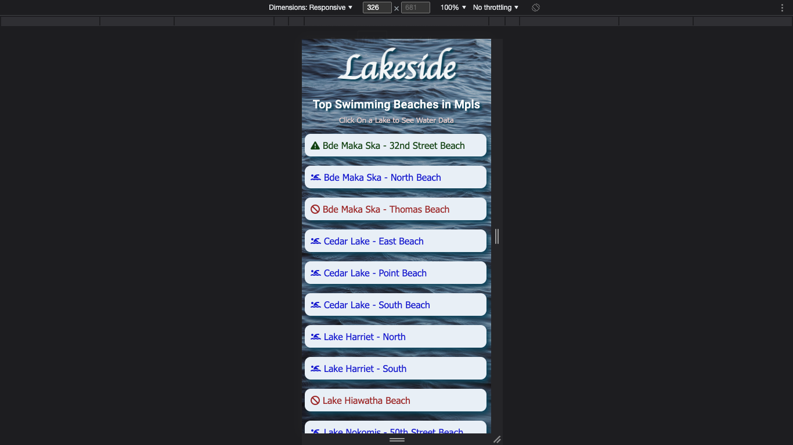
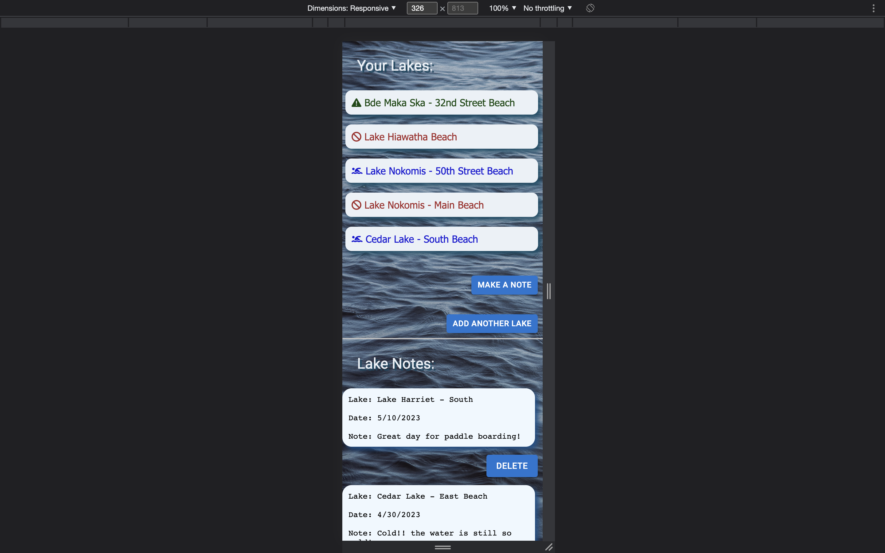
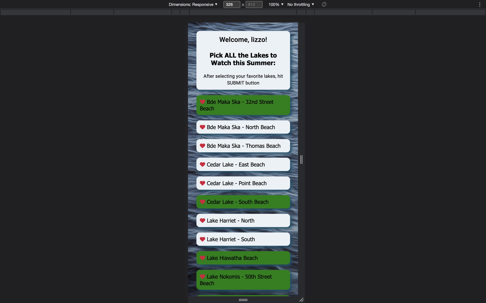
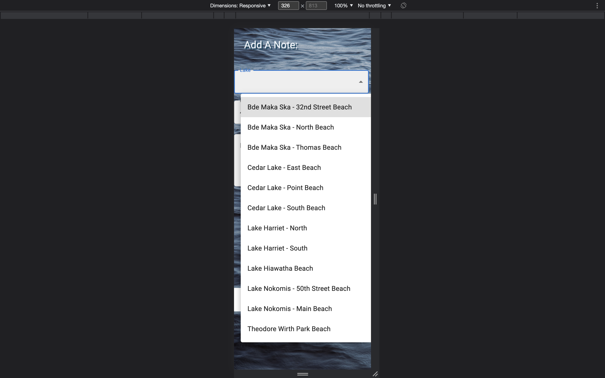
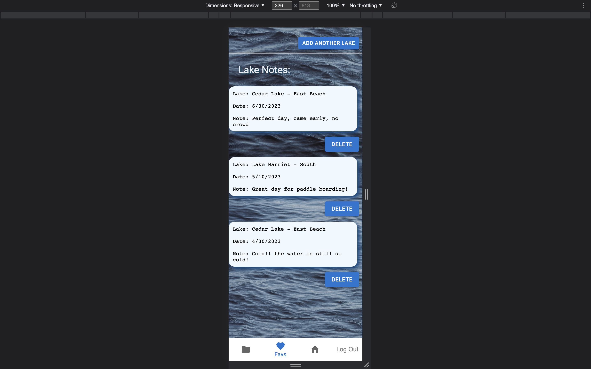

# Lakeside App

As our summer heats up, our lakes do too, and you must watch the water data throughout the summer to know which lakes are still available for swimming without getting you sick. This app was created to be a quick and easy way to inform you about the top Minneapolis swimming beaches and let you know which ones are healthy enough to swim in. 

## Lakeside Features
<ul>
  <li>A list of the top Minneapolis Beaches, labeled with both color and icons to show their status</li>
  <li>Clicking on the name of a lake gives you the water data for that lake</li>
  <li>An about page that tells about the app and gives you the link to Minneapolis Park and Recreation Board to get more information on how they collect the water data</li>
  <li>Sign-In and ability to customize your lake list to the lakes of your choosing</li>
  <li>While Signed-In, you can also make notes on the lakes throughout the season</li>
  <li>You can add more lakes to your list of lakes at any time</li>
</ul>

## Screen Shots of Lakeside
<br/>
<br/>
<br/>
<br/>
<br/>
<br/>
<br/>


## Built With
<ul>
  <li>React</li>
  <li>Redux</li>
  <li>Express</li>
  <li>Passport</li>
  <li>PostgreSQL</li>
  <li>Material UI</li>
</ul>
  
## Prerequisites

Before you get started, make sure you have the following software installed on your computer:

- [Node.js](https://nodejs.org/en/)
- [PostgreSQL](https://www.postgresql.org/)
- [Nodemon](https://nodemon.io/)

## Installation
<ol>
    <li>Create a database named: "lakes_app_data"</li>
    <li>The queries in the database.sql file are set up to create all the necessary tables and populate the needed data to allow the application to run correctly. The project is built on Postgres, so you will need to make sure to have that installed. We recommend using Postico to run those queries as that was used to create the queries</li>
    <li>Open up your editor of choice and run npm install</li>
    <li>Run npm run server in your terminal</li>
    <li>Run npm run client in your terminal</li>
    <li>The npm run client command will open up a new browser tab for you!</li>
</ol>

## Development Setup Instructions

- Run `npm install`
- Create a `.env` file at the root of the project and paste this line into the file:
  ```
  SERVER_SESSION_SECRET=superDuperSecret
  ```
  While you're in your new `.env` file, take the time to replace `superDuperSecret` with some long random string like `25POUbVtx6RKVNWszd9ERB9Bb6` to keep your application secure. Here's a site that can help you: [https://passwordsgenerator.net/](https://passwordsgenerator.net/). If you don't do this step, or if you create a secret with less than eight characters, or if you leave it as `superDuperSecret`, you will get a warning.
- Start postgres if not running already by using `brew services start postgresql`
- Run `npm run server`
- Run `npm run client`
- Navigate to `localhost:3000`

## Acknowledgments
<ul>
  <li>Aquamarine Cohort at Prime Digital Academy</li>
  <li>Prime Instructors: Emma, Key & Kris</li>
</ul>

## Production Build

Before pushing to Heroku, run `npm run build` in terminal. This will create a build folder that contains the code Heroku will be pointed at. You can test this build by typing `npm start`. Keep in mind that `npm start` will let you preview the production build but will **not** auto update.

- Start postgres if not running already by using `brew services start postgresql`
- Run `npm start`
- Navigate to `localhost:5000`

## Deployment

1. Create a new Heroku project
1. Link the Heroku project to the project GitHub Repo
1. Create an Heroku Postgres database
1. Connect to the Heroku Postgres database from Postico
1. Create the necessary tables
1. Add an environment variable for `SERVER_SESSION_SECRET` with a nice random string for security
1. In the deploy section, select manual deploy

## Update Documentation

Customize this ReadMe and the code comments in this project to read less like a starter repo and more like a project. Here is an example: https://gist.github.com/PurpleBooth/109311bb0361f32d87a2
